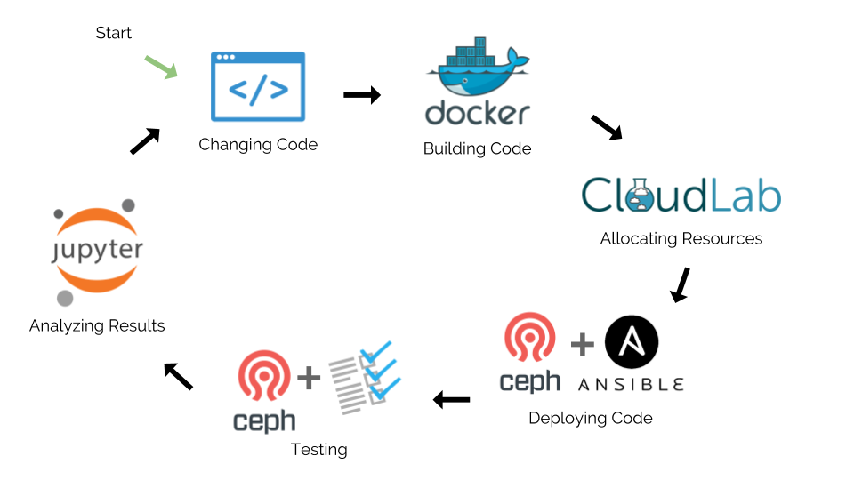
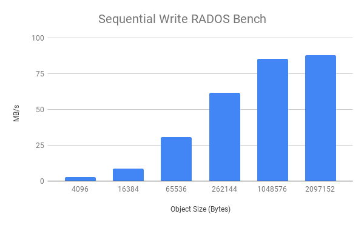

# Introduction
## Background
Setting up a distributed system like Ceph is hard and complex because there are many different components that make up Ceph. The goal of this project is to implement a workflow for Ceph experimentation. Instead of going the traditional route of manually installing everything in ad-hoc ways, a SciOps (DevOps for science) methodology is followed to create an experimentation workflow for Ceph. This results in having reproducible studies, transparency (open science), experiments that are amenable to collaboration and extension. In summary, we apply the SciOps methodology to Ceph experimentation that is typical of storage and data-management R&D settings (e.g companies such as Toshiba, WD, Samsung, etc.). This report describes the process of how the workflow was implemented and how it can be used.

The audience of this project is targeted towards several groups such as any newcomer of Ceph or existing users wanting a simple workflow for Ceph experimentation. Anecdotally, when students take a course in distributed systems and need to setup a distributed environment, it can take several weeks *just* to get the system up and running. If a student were in a ten week class, that does not give students enough time to play around with the system and report interesting observations or results since time is very limited. Reducing the overhead of the setup time will allow for more time working on a project versus spending time getting the system up and running. The workflow that has been implemented will allow for a variety of testing, but this paper focuses on one benchmarking test which will be performed as a proof of concept basis. Some of these tests which can be performed within Ceph include performance, scalability, correctness, availability, and overhead. The contributions of this project include: 

* Applying SciOps methodology to implement a Ceph experimentation workflow; 
* A template to deploy and test a Ceph cluster.  

The remainder of this paper is organized as follows, @Sec:approach describes the approach and technologies used to create the workflow. @Sec:pipeline goes into detail about the different stages in the pipeline. @Sec:challenge reflects on the challenges while creating the experimentation workflow. @Sec:results describes the experimental results and outcome of the experimentation workflow. Lastly, @Sec:future describes the future work and how this project can be further developed. 

## Ceph
Ceph [@weil_ceph] is an open source software that provides excellent performance, reliability, highly scalable objects, block, and file-based storage in a distributed system. Other features include having no single point of failure, using commodity hardware and dynamically increasing or decreasing nodes where the system will be able to fully recover with underlying algorithms.  

As previously mentioned Ceph is scalable. A Ceph cluster consists of many roles such as monitors, agents, OSDs, clients, managers, and rgws. For this project a small Ceph cluster is created, but the experiment is agnostic to the size of the cluster. When first starting out with Ceph, there is a minimum requirement of three nodes needed to get the system running. Each of these three nodes have their own role: a monitor node, one object storage device (OSD) node, and a client node. The monitor node contains a "cluster map" which is the set of maps comprising of the roles of a monitor, OSDs, placement group (PG), MDS, and CRUSH map [@ceph_docs]. These five different maps in the "cluster map" have knowledge of the whole cluster topology. Moreover, the monitor node provides logging and authentication services which are used when setting up the system. The OSD node is in charge of storing objects on a local file system and providing access to them over the network [@ceph_docs]. It is also important that there is one monitor node in a Ceph cluster because the monitor node acts as a leader for the cluster. Additionally, it is important to always have an odd amount of nodes in the system because we want the system to reach consistency so if there is an even amount of nodes there is a possibility of not obtaining a majority. When there is no majority, a system can get stuck and not reach consistency. For a proof of concept this paper focuses on a small system of three nodes; one monitor, one object storage daemon, and one client.
  
# Approach {#sec:approach}
In order to get a Ceph cluster running for experimentation, there are different tools that are used to automate and create a Ceph system; Cloudlab, Ceph Benchmarking Tool, Ceph-Ansible, Docker, and Popper. Some of these tools will need user credentials meaning that a user will need to create an account which are Cloudlab, Docker, and Github. Popper does not need credentials and can be installed through the terminal via the command, `pip install popper`. The first step in the workflow is changing/writing code and then building that code. Next, resources get allocated via Cloudlab. Proceeding this step, Ceph-ansible is used to deploy the code and then the Ceph Benchmarking Tool is used to run the different tests to be conducted on Ceph. Lastly, Jupyter is used to help analyze the results.
  
Cloudlab [@cloudlab] is an online service that hosts bare metal machines for users to create and compute a cloud environment. This is where the resources come from. It is also important to note that since Cloudlab is a hosting service, requested machines are only available for a certain amount of time. Data that has not been saved before the expiration time will be erased from the machines. Since the allocation of the machines, also referred as nodes throughout the paper, is automated it doesn’t matter too much that the machines expire because the machines can get reallocated fairly quickly.   
  
Docker [@docker], a container platform, helps containerize packages and environments which can be shared among multiple applications. Docker will help create the Ceph environment into a container so all of Ceph’s dependencies will be encapsulated together. As mentioned in the abstract, this workflow is only for MAC and Linux operating systems because of Docker. Docker does not work as easily and nicely on a Windows operating system which was observed from past experience. Once Docker has been installed onto a user's machine, then the obtaining images on Docker will be easy to pull from Docker hub which consists of many images. For this workflow, a base Docker images will contain all of the dependencies for some of the other mentioned tools will be contained within a container.   

Ansible [@anisble] is a software provisioning service which helps prepares an inventory file that defines a host. Ansible gathers the information from the allocated nodes and creates an inventory file with host information. Each of these hosts are affiliated with different; roles, monitor, client, and OSD.
  
Ceph-ansible [@ceph_ansible] uses Ansible to automate the installation of Ceph to create a Ceph cluster.  

Ceph Benchmarking Tool [@cbt], CBT, is a tool that is used to automate different testing harnesses on top of a Ceph cluster for performance and benchmarking. There are four main benchmarking modules this tool provides; radosbench, librbdfio, kvmrbdfio, and rbdfio. CBT is a layer on top of Ceph and does not install Ceph packages to create a cluster which is why Ceph-ansible is used to create the cluster. Furthermore, CBT has practical features such as to running the same test multiple times for larger
sample sizes and the ability to sweep through array of parameters in yml file. These features allow new users experiment with this environment with ease.

Jupyter [@jupyter], also commonly known as Jupyter Notebook, is an open source software interactive tool that integrates visuals, narrative text, and other forms of media in a single document. Jupyter is used in this workflow to help visualize our results which can then be analyzed for further testing.
  
Popper [@jimenez_2017_popper] is a command-line interpret tool and convention to create reproducible scientific articles and experiments. The convention is based on the open source software (OSS) development model which creates self-contained experiments that does not require external dependencies than what is already contained in the experiment. The Popper convention uses a pipeline that consists of shell scripts which executes an entire experiment. When a pipeline has been initialized, the pipeline consists of several default stages: the setup, run, postrun, validate, and teardown stage. These default stages are not required for every experiment and stages can be renamed accordingly to what makes sense for your experiment. For this experiment the stage names that are used are setup, deploy, run-benchmarks, teardown, and validate. In the setup stage, a user would usually download all the necessary files to run the project. These files are, for example, data files, libraries, and other dependencies. The run stage executes the script that is used to run the main part of the experiment. The postrun stage is where data can be manipulated so it is setup nicely to the validation stage. The validate stage is where a user would display the results obtained in the postrun stage. This stage could be used to open a log file that shows the results of the experiment or run a script that graphs and displays the results, for our case Jupyter will be used to showcase the results. Popper wraps all of these stages together so that this workflow can be deployed with only 

# Pipeline {#sec:pipeline}
## Prerequisites
There are four main prerequisites to run this experiment; Popper (v1.1.2), Docker (v2.0.0.3), a Cloudlab account and Github account. Any other additional dependencies that are needed to set up the cluster and benchmarking tool are contained in a Docker container, therefore no additional installation are required.

## Workflow
@Fig:workflow shows the Ceph experimentation automation cycle and @Lst:ceph_pop shows the pipeline of files for this experiment. This pipeline consists of the following main stages; setup, deploy, run-benchmarks, validate, and teardown. The main goal of this project is not only to create a Ceph experimentation environment but to also create that environment with minimal configurations. After a user has the prerequisites installed on their machine, a user can run the Ceph experimentation environment, with the current default cluster configuration and benchmarking test, with two commands:
```bash
cd Ceph/pipelines/ceph
popper run
```

{#fig:workflow}

In addition to the scripts to conduct the experiment, there are also other folders in the pipeline such as CBT, Ceph-ansible, Docker, and GENI. These folders indicate different tools are being used throughout the experiment. The use of each tool will be further explained in their appropriate stages.

```{#lst:ceph_pop .bash caption="Contents of Ceph Popper repository."}
Ceph-repo
| README.md
| .popper.yml
| pipelines
|   |-- ceph
|   |   |-- setup.sh
|   |   |-- deploy.sh
|   |   |-- run-benchmarks.sh
|   |   |-- teardown.sh
|   |   |-- validate.sh
|   |   |-- cbt/
|   |       |-- ceph.client.admin.key
|   |       |-- ceph.conf
|   |       |-- rbdmap
|   |       |-- conf.yml
|   |   |-- ceph-ansible/
|   |       |-- group_vars/
|   |           |-- all.yml
|   |           |-- osds.yml
|   |       |-- purge_cluster.yml
|   |       |-- site.yml
|   |   |-- Docker/
|   |       |-- cbt/
|   |           |-- Dockerfile
|   |           |-- install.sh
|   |       |-- ceph/
|   |           |-- Dockerfile
|   |           |-- install.sh
|   |   |-- geni/
|   |       |-- clemson.xml
|   |       |-- machines
|   |       |-- release.py
|   |       |-- request.py
|   |       |-- renew.py
|   |       |-- monitor_config.py
|   |   |-- results/
| paper
|   |-- build.sh
|   |-- figures/
|   |-- paper.md
|   |-- paper.pdf
|    -- references.bib
```

## Setup.sh
The setup stage consists of requesting resources. As mentioned earlier, the resources for this experiment will come from Cloudlab. The resources that are being used for this project, Ceph is using Cloudlab's cluster Clemson and type c6320. @Lst:cl shows the Clemson cluster hardware specifications for type c6320. The Clemson cluster was chosen versus the other available clusters because of the amount of storage this specific hardware had to run Ceph.

```{#lst:cl .bash caption="Cloudlab Clemson c6320 hardware specifications."}
CPU   Two Intel E5-2683 v3 14-core CPUs 
      at 2.00 GHz (Haswell)
RAM   256GB ECC Memory
Disk  Two 1 TB 7.2K RPM 3G SATA HDDs
NIC   Dual-port Intel 10Gbe NIC (X520)
NIC   Qlogic QLE 7340 40 Gb/s Infiniband 
      HCA (PCIe v3.0, 8 lanes)
```

For this experiment there are five environment variables that need to be declared in order to begin the request of the nodes which can be retrieved from a user's Cloudlab account; `CLOUDLAB_USER`, `CLOUDLAB_PASSWORD`, `CLOUDLAB_PROJECT`, `CLOUDLAB_PUBKEY_PATH`, `CLOUDLAB_CERT_PATH`. Once the following environmental variables have been declared, these variables are passed into a Docker container to request resources autonomously through the GENI tool. GENI is an API that allows for a user to interact with the Cloudlab hardware. Furthermore, the request API allows users choose which hardware they want to use. For our case Clemson c6320 is chosen. After the request of the resources is completed, a `cl-clemson.xml` file is formed with all of the specifications for *X* amount of nodes, where *X* is the amount of nodes a user wants for their experiment. Next, a `machines` file is written to group the allocated resources from Cloudlab. Lastly, the monitor IP address gets copied from the `cl-clemson.xml` into the the `all.yml` file in the ceph-ansible folder to prepare for the deployment of the cluster. @Lst:setup shows which files are used for this stage and the descriptions of a files' functionality. 

```{#lst:setup .bash caption="Setup stage file breakdown."}
clemson.xml
   - Specifications for each node
machines
   - Allocated resources grouped
request.py
   - Request resources from Cloudlab
renew.py
   - Renew resources from Cloudlab
monitor_config.py
   - Copying monitor IP address for 
     deploy stage
```

## Deploy.sh
After allocating resources, a Ceph cluster can be deployed. The tool that is used to create the Ceph cluster is Ceph-ansible. Ceph-ansible requires a few configuration files to deploy the cluster which can be referred to @Lst:ceph_pop. First, all of the allocated nodes gets cleared and erased to make sure no previous version of Ceph has been installed by purging the cluster. This will guarantee a clean slate when Ceph is installed and erase any exsisting Ceph versions on the nodes. Next, the cluster design gets deployed where the monitor, client, and OSD roles are assigned to server groups. @Lst:deploy shows the files that are used in the pipeline to create and configure a Ceph cluster.

```{#lst:deploy .bash caption="Deploy stage file breakdown."}
all.yml
   - Cluster network configuration settings
osd.yml 
   - Osd configuration
site.yml 
   - Defined deployment design and assigns 
     role to server groups
purge-cluster.yml 
   - Purge and clean out any exciting Ceph 
     Installation on the nodes
Dockerfile
   - Container containing Ceph-ansible 
install.sh
   - Clone Ceph-ansible and requirements
```

The way to verify that the Ceph cluster is up, is by checking the status of the Ceph cluster by one of three ways. The first was is by looking at the end of the log from the deploy stage or secondly `ssh` into the monitor node and use the command `sudo ceph -s` to view the status of the cluster. @Lst:ceph_config shows a sample output of a running cluster. Note that `health` has a warning. That warning can be ignored because in the configuration files when deploying the cluster, the mgr role was omitted. Another way to make sure that the cluster is configured properly is verifying that the OSDs are up and running. This can be checked my looking at the `services > OSD` from the output. In this case, it is shown that two OSDs are up. If the OSDs are not up and running, that indicates a cluster has not been connected properly.

There are two important checks that need to made to verify that a Ceph was configured correctly; the status of the cluster and OSD is connected. It is important to note that both of these need to have the correct output or else a Ceph cluster is incomplete. The health status of a cluster should either be `HEALTH_WARN` or `HEALTH OK`. The warning can be ignored because in the configuration files when deploying the cluster, the mgr role was omitted.

```{#lst:ceph_config .bash caption="Cluster configuration output."}
  cluster:
    id:     xxx-xxx-xxx-xxx-xxxxx
    health: HEALTH_WARN
            no active mgr
 
  services:
    mon: 1 daemons, quorum node0
    mgr: no daemons active
    osd: 1 osds: 1 up, 1 in
 
  data:
    pools:   0 pools, 0 pgs
    objects: 0  objects, 0 B
    usage:   0 B used, 0 B / 0 B avail
    pgs: 
```

## Run-benchmarks.sh
Once a Ceph cluster is up and running, tests can be conducted on the cluster. As mentioned previously there are four different modules that CBT, Ceph Benchmarking Tool, provides; radosbench, librbdfio, kvmrbdfio, and rbdfio. Of these four testing modules, this pipeline conducts the radosbench test. @Lst:benchmark shows the files that are used in the pipeline to run the Ceph benchmarking tool.

```{#lst:benchmark .bash caption="Run-benchmark stage file breakdown."}
ceph.conf
   - Ceph configuration settings
conf.yml
   - Test configuration files to create 
     parametric sweeps of tests
Dockerfile
   - Container containing cbt
install.sh
   - Clone cbt and requirements
```

Within the Ceph benchmarking tool there are some notable configurations that are important when running benchmarks. First, declaring the head, mons, client, and osd nodes. (@Tbl:roles) describes the roles and their functionality during the benchmarking process. When looking at the `conf.yml`, it is also important to note that the head node is also the monitor node. It's important that the head node is one of the monitor nodes because the monitor contains the cluster map of the system. This allows Ceph commands to be run and direct where the test should be ran. The second notable configuration a user needs to be aware of are the `pg_size` and `pgp_size` parameters. These parameters need to fit in within the specifications noted in @Tbl:osd_count because they are placement groups inside of Ceph which determines how data will be distributed in the system. Since this example cluster only contains 1 OSD, `pg_size` and `pgp_size` are set to 128. If a user decided to increase the number of OSDs in their cluster, then the table can be used as a reference of how this setting can be changed. 

|Roles|Node setup|
|---|---|
|head|Node where general ceph commands are run|
|mons|Node(s) where mons will live|
|clients|Node(s) that will run benchmarks or other client tools|
|osds|Node(s) where OSDs will live|

: Ceph benchmarking tool node setup and roles. {#tbl:roles}

|OSD count|pg_size|pgp_size|
|---|:-:|:-:|
|Less than 5|128|128|
|Between 5 and 10|512|512|
|Between 10 and 50|4096|4096|

: OSD count configuration for small clusters. If a cluster consists of 50 or more OSDs further computation needs to be computed which is out of the scope for this project. {#tbl:osd_count}

As mentioned previously the benchmarking test that is being run for this demonstration is a radosbench test which means that this test is conducting performance benchmarking on a RADOS storage cluster. 

## Validate.sh
Lastly, in the validate stage, the data from the tests that have been conducted will be analyzed using Jupyter Notebook which is the last stage of the workflow. 

## Teardown.sh
Once a user has completed their experiment there are two ways to terminate all of the allocated machines back to Cloudlab which will erase all of the data that was installed. The first method is letting the resources expire. The second way is using Cloudlab's release API to release the resources back into the resource pool. The teardown stage script will differ depending where the resources has been allocated, just like the setup stage's script. 

# Results {#sec:results}

After running the benchmarks test and validating the results to create a graph, @Fig:result shows the results from a sample test. There are many other tests that can be conducted within Ceph, but for this project a sample is demonstrated for users to use as a template and further experiment within this environment. @Fig:result shows the performance on a sequential write benchmarking test on a RADOS storage cluster comparing bandwidth (MB/sec) and the object size (Bytes). One can observe that for this setup, the object size is directly proportional to the bandwith which tells the user how fast their cluster can write data.

{#fig:result}


# Challenges {#sec:challenge}
With any project, there are always obstacles that are faced through the process. The first main challenge going into this project was having minimal knowledge of Ceph. Having minimal knowledge of Ceph required me to catch up on the understanding of Ceph and not having prior experience creating a Ceph cluster. So while learning about how this environment workflow was supposed to set up, I had to also gain some understanding of what the environment does and how it works. This brings up the next challenge while working on this project and the one of the main purposes of this project, creating a Ceph cluster. 

A key part of this workflow is for the pipeline to be reproducible. Incorporating reproducibility from the beginning is important so this entire workflow can be portable from one machine to another. Being a newcomer to Ceph and automating the whole process while keeping reproducibility in mind from the start was difficult because there was a lot of different components to keep track from the very beginning. Despite that difficulty, creating a reproducible workflow from the beginning helped when I encountered issues and needed assistance for debugging. 
 
Another challenge that pushed back the timeline of getting this pipeline working was having to change cloud hosts two times along the way. The first cloud host subscription expired, so then another alternative was suggested and create a local Ceph system. However, the local distribution failed due to permission rights on a Linux - Ubuntu machine and having to change some hardware settings that I didn’t want played with. In hindsight a virtual machine would have been a better solution for the local Ceph system, but another main goal of the project was not to use a virtual machine. Virtual machines are useful, but require more installation steps versus just using Docker containers.

Another one of the challenge encountered was allocating nodes in Cloudlab. Cloudlab nodes consists of a variety of hardware, so when first starting out and allocating nodes, the nodes that were being allocated from the Cloudlab Utah cluster where the node had 256GB on the disk. There was a memory storage limit that was encountered since Ceph has a lot dependencies. Switching to the Cloudlab Clemson solved this issue.

# Future Work {#sec:future}
Thus far this project has provided a template on how to get started on creating and conducting a test on a Ceph cluster with a default test harness. One feature that can be considered is incorporating other resource facilities for node allocation. As of right now, Cloudlab is the main facility this project is gathering its resources from which is not accessible for everyone. Cloudlab is for academia and is not open to everyone compared to Amazon Web Services, as an example. Adding other resource facilities such Amazon Web Services (AWS) or Chameleon will allow for a greater audience to use this experimentation workflow. Furthermore, using other resource facilities will not change the Ceph experimentation environment. The only change that'd occur are the setup and teardown stages of the pipeline because the main middle stages only require an inventory of the hosts and its roles for creating and testing in the cluster. 

# Conclusion {#sec:conclusion}
In conclusion, building a Ceph distributed system is not an easy, straight forward task because there are different components that need to be put together. Additionally, it can take multiple weeks just to get the system running so in a class setting where weeks are limited most of the time is spent troubleshooting and debugging the system versus spending time obtaining interesting results to analyze and then make further tests within Ceph. This workflow, once understood, provides a lightweight automated, reproducible Ceph experiment environment.


# References {.unnumbered}

\noindent
\vspace{-1em}
\setlength{\parindent}{-0.18in}
\setlength{\leftskip}{0.2in}
\setlength{\parskip}{0.5pt}
\fontsize{7pt}{8pt}\selectfont